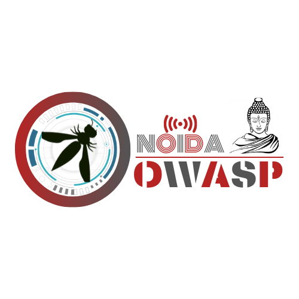

<h1 align="center"></h1>

# OWASP Noida Chapter

Welcome to the OWASP Noida Chapter! We are a vibrant community of cybersecurity enthusiasts, professionals, students, and researchers dedicated to fortifying the digital defenses of Noida, India.

## About Us

Nestled in the heart of Noida, the OWASP Noida Chapter is a beacon of cybersecurity excellence. Our mission is to foster a culture of secure software development and empower individuals with the knowledge and tools to create resilient digital solutions.

Noida, known for its tech-savvy environment, is the perfect backdrop for our chapter. Here, we unite experts and newcomers in a dynamic ecosystem where we exchange ideas, share experiences, and stay updated on the ever-evolving landscape of application security. As a vital tech hub, Noida is a melting pot of diverse talents and industries, making our chapter a unique platform for pioneering discussions and advancements in cybersecurity.

Join us on our journey to enhance the cybersecurity fabric of Noida's digital landscape and make a lasting impact on software security. Together, we work tirelessly to build a more secure and trustworthy online environment for everyone.

## Upcoming Events

Stay tuned for our upcoming events, workshops, and meetups. Join us for enlightening discussions, hands-on training, and networking opportunities.

## Get Involved

Participate in our mission to enhance application security:

- **Attend Events:** Join us at events, workshops, and meetups to learn from experts and connect with like-minded cybersecurity enthusiasts.
- **Speak:** If you're an application security expert, consider sharing your knowledge at one of our events and contribute to the community.
- **Contribute:** Collaborate on open-source projects, engage in research, and promote awareness of cybersecurity best practices.
- **Connect:** Engage in discussions, share resources, and stay updated with the latest news on our online platforms:

  - [Connect us on Twitter](https://linkedin.com/owaspnoida)
  - [Follow us on Twitter](https://twitter.com/owaspnoida)
  - [Follow us on Facebook](https://www.facebook.com/owaspnoida/)
  - [Follow us on Instagram](https://www.instagram.com/owaspnoida/)
  - [Follow us on MeetUp](https://www.meetup.com/OWASP-Noida-Chapter/)

## Participation

The Open Web Application Security Project (OWASP) is a nonprofit foundation dedicated to enhancing software security. Our wide array of projects, tools, documents, forums, and chapters are open to all who share an interest in advancing application security.

Local OWASP chapters are led by community leaders who adhere to the Chapters Policy. If you wish to make a financial contribution, please use the authorized online donation button.

We extend a warm invitation to everyone to get involved in various aspects of OWASP:

- **Projects:** Contribute to and collaborate on our diverse projects.
- **Local Chapters:** Join or lead a chapter in your area.
- **Events:** Participate in OWASP events and gatherings.
- **Online Groups:** Engage in discussions and knowledge sharing.
- **Community Slack Channel:** Join our Slack channel for real-time interaction.

Diversity is a fundamental value across all our initiatives. OWASP is an excellent platform to learn about application security, establish valuable connections, and elevate your reputation as an expert in the field. We also encourage you to consider becoming a member or making a donation to support our ongoing efforts.

## Become a Presenter/Speakers

Would you like to speak on the upcoming OWASP Noida Webinar? [Contact Us](mailto:om.kumar@owasp.org)

**Email Format :**

- Speaker name
- Job Role
- Company / Organization
- Country
- Email ID
- Contact Number
- Speaker Profile
- Presentation Details
    - Name / Title of the Presentation
    - Abstract of the presentation
    - Presentation time required
 
## Contact Us

Do you have questions or want to get in touch? Reach out to our chapter leader at [deepak.kumar@owasp.org](mailto:deepak.kumar@owasp.org) , [deepak.kumar@owasp.org](mailto:om.kumar@owasp.org)

Join us in our mission to secure the digital world, one line of code at a time!

---
